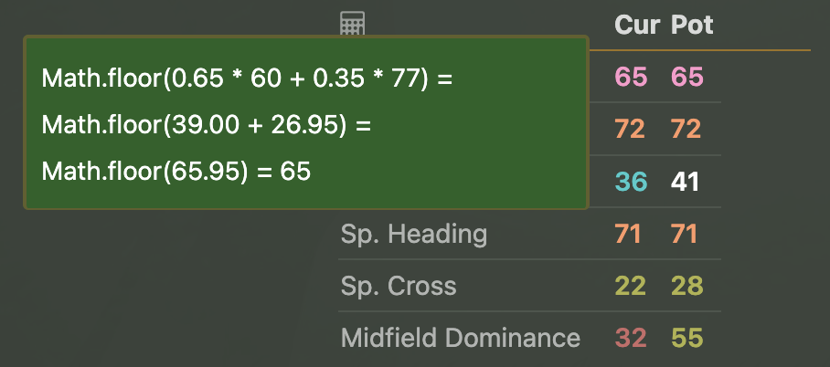

# Final Whistle assistant
I created this browser extension to address some of the problems that, in my opinion, the game interface has. The main idea was to make the midfield dominance easily visible on the squad page as well as on the player page. Midfield dominance being (as of time of writing - August 2025) the main factor in opportunity creation, I think it deserves much more attention than just a mention in the manual.

## Supported browsers & download links
1. Chromium based browsers like Chrome or Brave - [the extension is available in the Chrome web store](https://chromewebstore.google.com/detail/final-whistle-assistant/hcnoehlpicjabafnchohpbocakdnmimn).
2. Firefox - [the extension is available on the Firefox extensions page](https://addons.mozilla.org/en-US/firefox/addon/final-whistle-assistant/)

## Options - Available modules
The extension is split into modules, each module is responsible for different functionality and you can turn each module on or off in the extension settings.

As of version **1.1.0** the settings page on Firefox looks like this

As of version **1.3.0** the lineup module is available, and there are additional settings for that module:

Similarly this is the settings page on the Chromium browsers

Use it to enable/disable modules you like. Remember to reload the Final Whistle website for the changes to take effect.

## Academy Buttons module
The goal of this module is to move the **Hire** and **Fire** buttons apart to prevent accidental missclicks. It was inspired by one of the posts from the [Requested Features List topic](https://www.finalwhistle.org/en/forum/topic/125/page/103)

## Calendar module
Calendar module adds **Y** and **S** letters to the match marker on the fixtures screen and on the club screen (upcoming matches section). This is again inspired by the [Requested Features List topic](https://www.finalwhistle.org/en/forum/topic/125/page/103) and the goal is to help distinguish which match is youth and which match is seniors, for the one of us that can't remember which color is what.

## Lineup module
Lineup module displays additional information in a form of markdown on the lineup->set pieces screen. It is designed to give you a quick overview of which players are suited for special roles, like captain or penalty taker. When in doubt, hover over the symbol and a tooltip will be displayed give you additional information.

There are several symbols available:
 - 📂 - is used to indicate that there is no information available for this player - just visit the player page and the extension will save the info it needs, then reload the lineup screen
 - ✪ - is used to represent the leadership trait. Here is how colors represent different values:
  - ✪ represents -2
  - ✪ represents -1
  - ✪ represents 1
  - ✪ represents 2
 - ○ - is used to represent the composure trait. Here is how colors represent different values:
  - ○ represents -2
  - ○ represents -1
  - ○ represents 1
  - ○ represents 2
 - ♛ - is used to represent the arrogance trait. Here is how colors represent different values:
  - ♛ represents -2
  - ♛ represents -1
 - ⚖ - is used to represent the sportsmanship trait. Here is how colors represent different values:
  - ⚖ represents -2
  - ⚖ represents -1
  - ⚖ represents 1
  - ⚖ represents 2

You will notice that sometimes the symbols don't appear even if a player has the specified personality trait. This is to limit the clutter, as you may safely ignore some of the information that is not relevant. For instance leadership and sportsmanship is always displayed because it's relevant for all players - you want to see which players are suited or not to be a captain, and you want to see which players are likely to foul to decide who to place on CB or DM, but also for other positions ⚖ is better avoided so this information is always useful. However composure is only important for players that shoot the ball, so is only showed for forwards and players with relevant penalty kick skill (see next paragraph). Similarly, arrogance in context of offside plays is only relevant if the player plays in defence, so only defenders and players with relevant DP skill (see next paragraph) will have it. 

Some fine tuning options are available for the lineup module in the extension options.
 - Composure treshold can be used to fine tune which players will display the composure symbol - the composure treshold defines the penalty kick value above which the symbol will be shown. For instance, you would assume that your defensive midfielder with awful scoring should not show the composure symbol, however if he has awesome passing he may be considered for taking a penalty in which case the composure symbol next to his name would still be useful.
 - Arrogance treshold can be used to fine tune which players will displaye the arrogance symbol - if the player has negative arrogance personality trait and is positioned in the defence, or is a substitute and his DP is above this treshold, markup will appear next to his name. It's defined like this for two reaosns: for your senior or youth teams you may want to set a different treshold because the skill difference is usually significant, and for the substitute players we don't know which of them are coming in as defenders, so linking it to DP skill allows for narrowing it down and showing the arrogance symbol only for the relevant subs.

## Player module
Player module adds additional row for the midfield dominance calculation in the computed properties table on the player page. It shows both current and potential midfield dominance contribution of a player. If you hover over the numeric values you will see the formulas that are used for calculations.

As of version **1.1.0** the special talents are **not** taken into account, so keep that in mind that it's not 100% accurate yet.
In version **1.2.0** the tooltips were added to the computed skills table, explaining the formulas used for calculations.

## Players module
The main idea behind the players module is to show the midfield dominance on your squad page. In addition it also shows the long shot ability and midfield dominance when in advanced position (**L/RW**, **OM**, **DM**). If you hover over the numeric values you will see the formulas that are used for calculations.

## Row Highlight module
Row highlight allows you to highlight any row on your or your opponent squad page. It can be useful when analyzing lineups for the upcoming games.

## Tags module
Tags module makes player tags much bigger and allows you to customize tag colors. The original game interface is not ideal, in my opinion, when it comes to tags size and the color selection. With the tags module you get the ability to choose the colors that are more suitable to your needs - do this in the extension options. The tags on the squad sceen and on the training screen are affected.

## Version history
### 1.1.0 - current version
 - Added working options screen
### 1.0.4
 - Added midfield dominance calculations to the computed skills table on the player page
### 1.0.3
 - Fixed the scroll bar appearing at the bottom of the player screen
### 1.0.2
 - Extension becomes multiplatform - works on FF and Chrome-based browsers
 - Updated the midfield dominance calculation for season 25
 - Added the LS formula and calculations to be displayed on hover
### 1.0.1
 - Aligned the players.js script to function properly with the recent changes on the website
### 1.0.0
 - Initial version with 4 modules
