# Final Whistle assistant
I created this browser extension to address some of the problems that, in my opinion, the game interface has. The main idea was to make the midfield dominance easily visible on the squad page as well as on the player page. Midfield dominance being (as of time of writing - August 2025) the main factor in opportunity creation, I think it deserves much more attention than just a mention in the manual.

## Supported browsers & download links
1. Chromium based browsers like Chrome or Brave - [the extension is available in the Chrome web store](https://chromewebstore.google.com/detail/final-whistle-assistant/hcnoehlpicjabafnchohpbocakdnmimn).
2. Firefox - [the extension is available on the Firefox extensions page](https://addons.mozilla.org/en-US/firefox/addon/final-whistle-assistant/)

## Options - Available modules
The extension is split into modules, each module is responsible for different functionality and you can turn each module on or off in the extension settings.

As of version **1.1.0** the settings page on Firefox looks like this

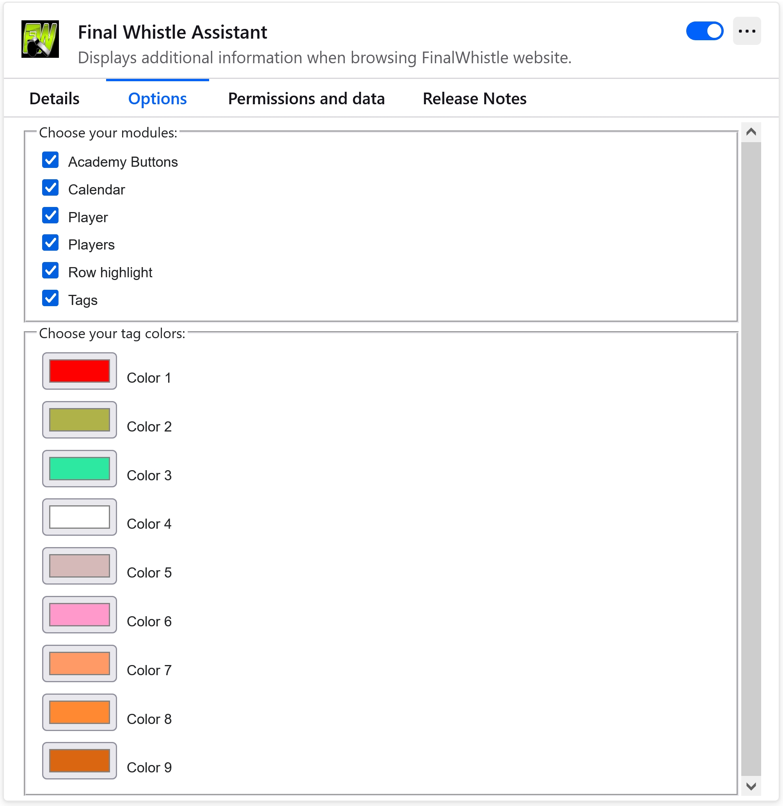

As of version **1.3.0** the lineup module is available, and there are additional settings for that module:

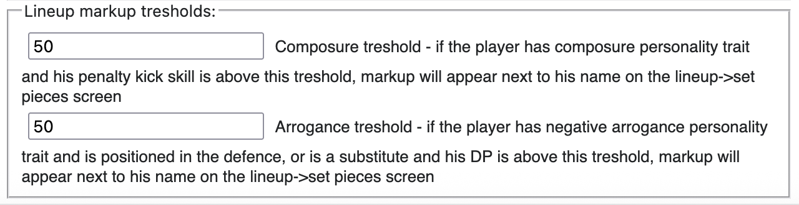

Similarly this is the settings page on the Chromium browsers

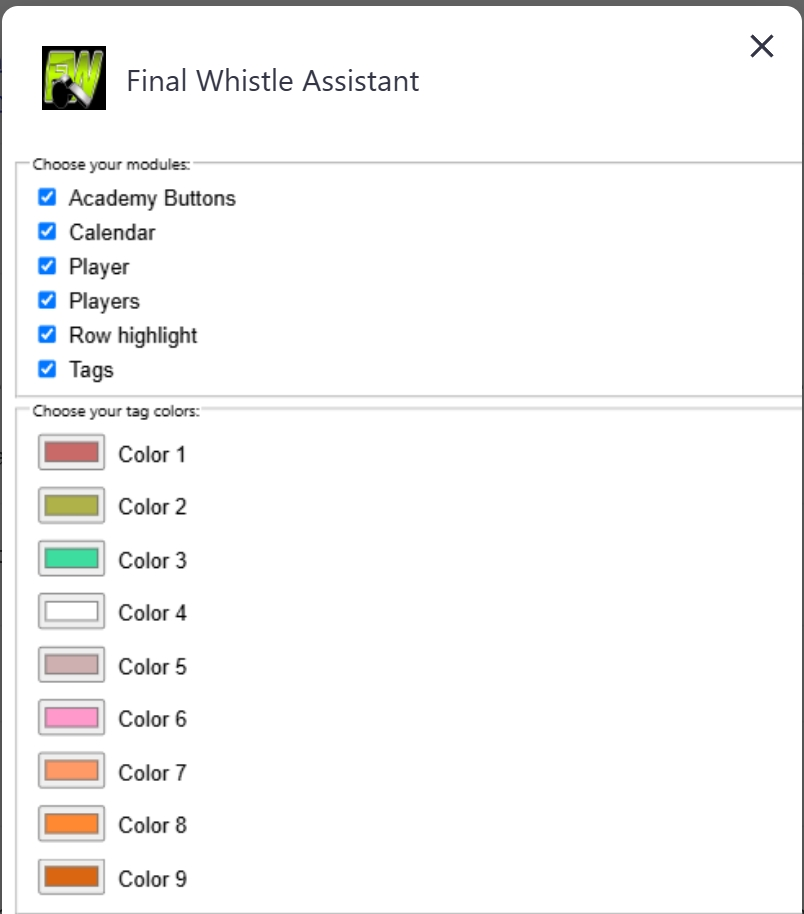

Use it to enable/disable modules you like. Remember to reload the Final Whistle website for the changes to take effect.

Starting with version **1.4.0** the new setting for player data was added:

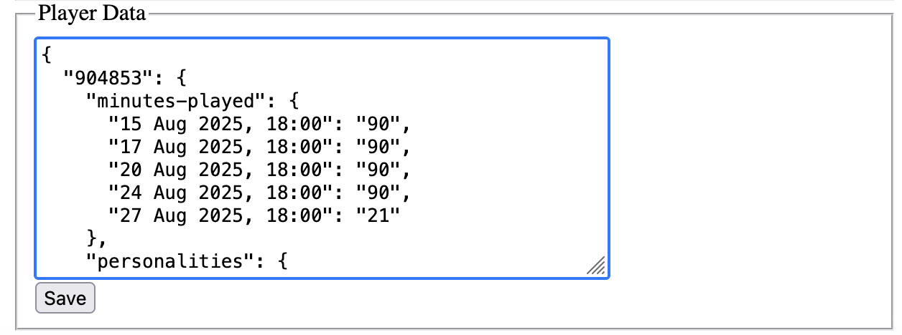

This setting can be used to backup your player data. Player data is all the data you gathered by visiting you players pages, match reports etc. You build this over time by browsing the game website. The extension works best if you visit all the match reports of your team that you can (switching the lineup from starting to finishing) and all the players that you have on your team. This allows the extension to visualize the injuries, minutes played, suggest penalty takers etc. Once you do all that you don't want this data to be lost - this is why I added this additional option. I recommend you do the following: once you visit all the match reports and player pages, got to the settings and copy the content of this new field into a file, and store it somewhere safe - for example Dropbox or another cloud storage service. This way you are sure that if something goes wrong and you loose the data, you can always resotre it from backup. To do that you can paste the contet of your backup directly into the new field and press the save button below. This is also useful for moving your data across browsers (Firefox and Chromium) or different machines.

One more improvement in **1.4.0** is that all the settings except player data now use storage.sync. This means that the information about used modules, colors and tresholds will be carried over to other instances of this browser when you log in there with your account. For example, if you use Firefox and are logged into your Firefox account, you can then install Firefox on another machine and log in there, and your settings will automatically be restored there when the extension is installed.

## Academy Buttons module
The goal of this module is to move the **Hire** and **Fire** buttons apart to prevent accidental missclicks. It was inspired by one of the posts from the [Requested Features List topic](https://www.finalwhistle.org/en/forum/topic/125/page/103)

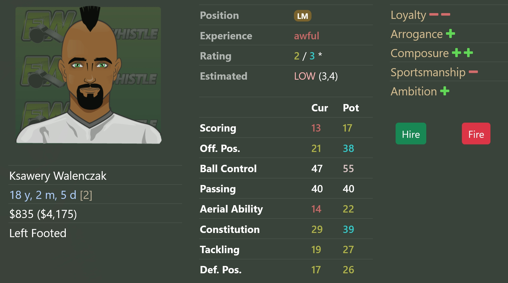

## Calendar module
Calendar module adds **Y** and **S** letters to the match marker on the fixtures screen and on the club screen (upcoming matches section). This is again inspired by the [Requested Features List topic](https://www.finalwhistle.org/en/forum/topic/125/page/103) and the goal is to help distinguish which match is youth and which match is seniors, for the one of us that can't remember which color is what.

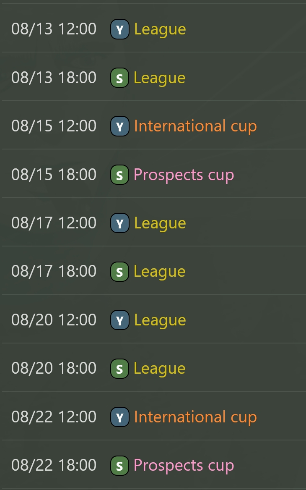
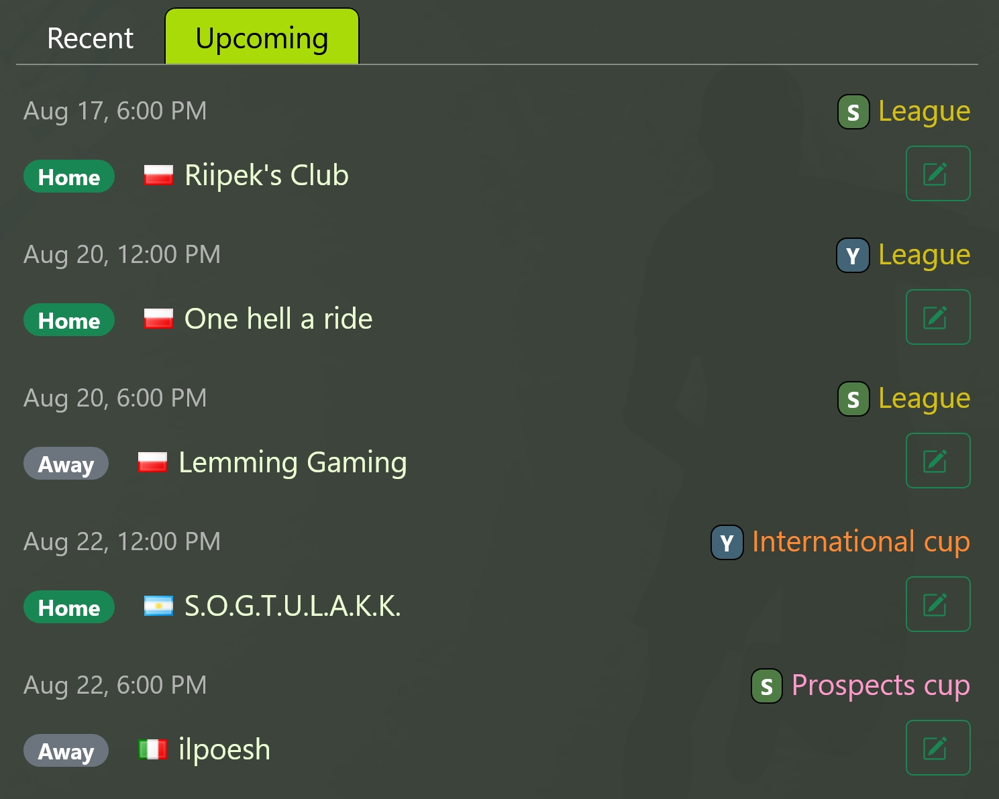

## Lineup module
Lineup module displays additional information in a form of markdown on the lineup->set pieces screen. It is designed to give you a quick overview of which players are suited for special roles, like captain or penalty taker. When in doubt, hover over the symbol and a tooltip will be displayed give you additional information.

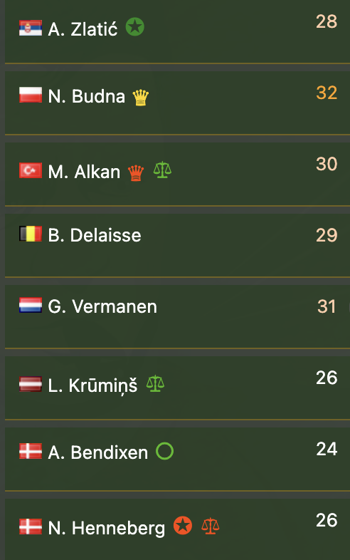

There are several symbols available:
 - 📂 - is used to indicate that there is no information available for this player - just visit the player page and the extension will save the info it needs, then reload the lineup screen
 - ✪ - is used to represent the leadership trait
 - ○ - is used to represent the composure trait
 - ♛ - is used to represent the arrogance trait
 - ⚖ - is used to represent the sportsmanship trait

You will notice that sometimes the symbols don't appear even if a player has the specified personality trait. This is to limit the clutter, as you may safely ignore some of the information that is not relevant. For instance leadership and sportsmanship is always displayed because it's relevant for all players - you want to see which players are suited or not to be a captain, and you want to see which players are likely to foul to decide who to place on CB or DM, but also for other positions sportsmanship -2 is better avoided so this information is always useful. However composure is only important for players that shoot the ball, so it's only shown for forwards and players with relevant penalty kick skill (see below). Similarly, arrogance in context of offside plays is only relevant if the player plays in defence, so only defenders and players with relevant DP skill (see below) will have it. 

Some fine tuning options are available for the lineup module in the extension options:

 - Composure treshold can be used to fine tune which players will display the composure symbol - the composure treshold defines the penalty kick value above which the symbol will be shown. For instance, you would assume that your defensive midfielder with awful scoring should not show the composure symbol, however if he has awesome passing he may be considered for taking a penalty in which case the composure symbol next to his name would still be useful. As of version **1.4.0** composure treshold is also used for recommending the penalty takers - essentially the extension will only recommend the players with the penalty kick computed skill value higher than the composure treshold you set in options.
 - Arrogance treshold can be used to fine tune which players will display the arrogance symbol - if the player has negative arrogance personality trait and is positioned in the defence, or is a substitute and his DP is above this treshold, markup will appear next to his name. It's defined like this for two reasons: for your senior or youth teams you may want to set a different treshold because the skill difference is usually significant, and for the substitute players we don't know which of them are coming in as defenders, so linking it to DP skill allows for narrowing it down and showing the arrogance symbol only for the relevant subs.
 
Form version **1.4.0** the recommended penalty takers are available. The extension calculates the penalty kick skill for the players in the lineup and recommends the best takers to you. It also takes into account composure personality as the players with positive composure have better chance of shooting on target. Players with negative composure are not recommended by the extension. Note that the extension has a very strong bias towards positive composure - it is possible that players with significantly lower penalty kick skill will be recommended instead of other players without composure trait, even though the other players penalty kick skill is much higher. Normally the extension should recommend 5 players:
 
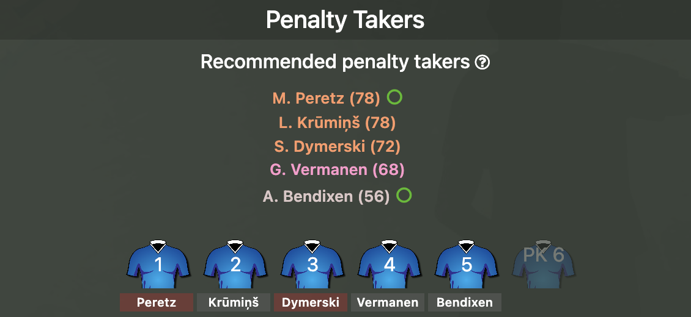
 
In the image you can see that the player with positive composure is prioritised over another player with identical penalty kick skill. Note that players with penalty kick skill below the composure treshold setting (you can adjust this in the extension options) will not be recommended. This may lead to a situation that you have less than 5 recommendations:
 
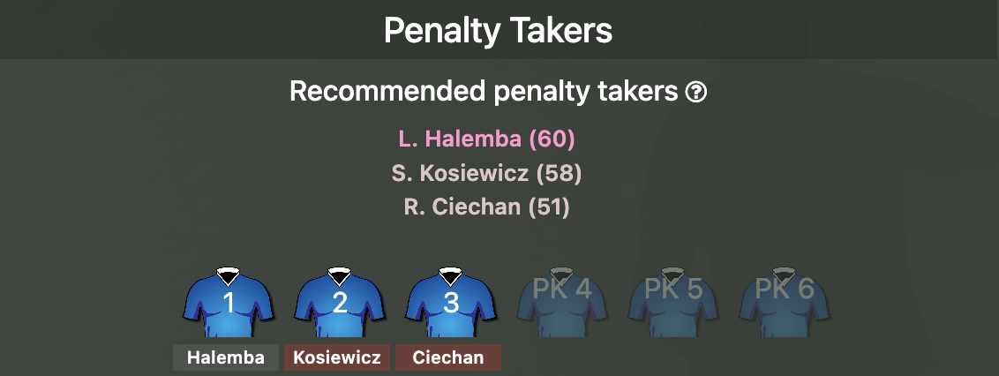
  
If you feel like one of your players is missing in the recommended set, make sure you visit his page to make sure the extension saves his data, otherwise he is not taken into account during calculations.

## Match module
Match module gathers the data about injuries and minutes played by your players. The idea behind this functionality is to have some data to predict when the next injury may happen. Currently the quick matches and friendlies are ignored since, to my understanding, they don't contribute to injuries. **For the match module to work correctly you need to visit the match report and switch the lineups from starting to finishing**.

[Go to Player module section](#player-module) to see how the data gathered in the match module is utilized there to display the additional information about injuries and minutes played by your players.

## Player module
Player module adds additional row for the midfield dominance calculation in the computed properties table on the player page. It shows both current and potential midfield dominance contribution of a player. If you hover over the numeric values you will see the formulas that are used for calculations.

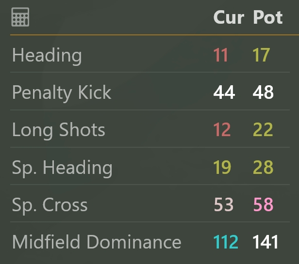

Note that special talents are **not** taken into account yet.
In version **1.2.0** the tooltips were added to the computed skills table, explaining the formulas used for calculations. Later in version **1.4.0** the tooltips were standardized to look more like native FW tooltips. They now appear on the right of the table and should not obstruct anything else.

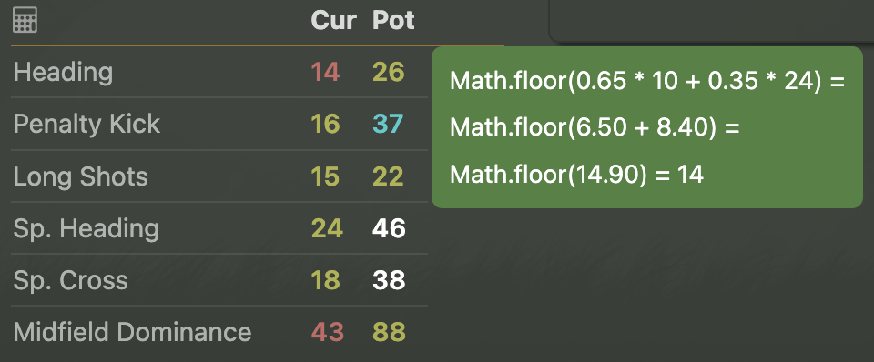

From version **1.4.0** the injuries and minutes played functionality is available:

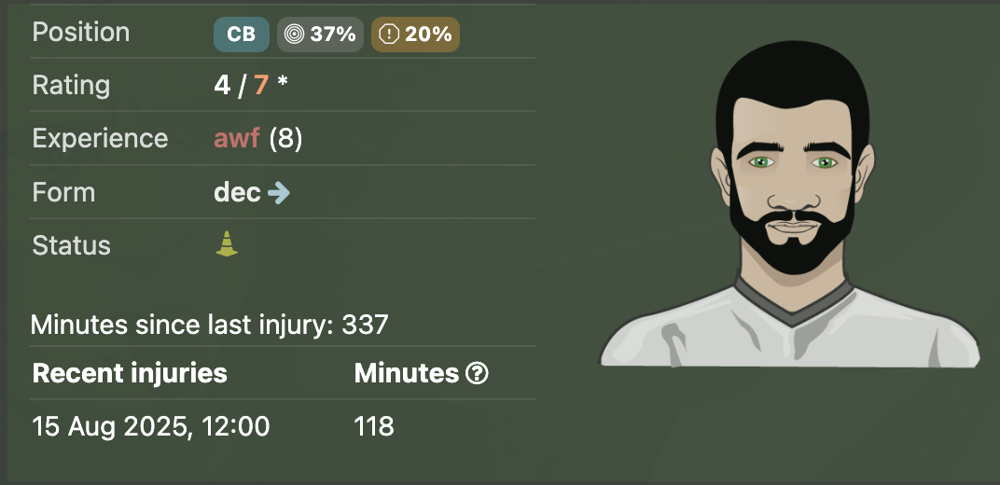

For this to work correctly you need to make sure to visit as many match reports as you can and always switch the lineup from starting to finishing, only then the information about injuries and minutes played are visible. Rememeber that this is not the exact value used in the game but rather an estimation based on assumptions and approximations. For instance, I assume that in the game where a player gets injuried all the minutes are counted towards the minutes before that injury, even though it is likely that the player continues to play with the injury until the end of the match. Nevertheless I feel this should still give us pretty good idea about how many minutes a player can usually play before getting injuried, and plan our season accordingly.

In case your player has not been injured, you will see how many minutes he played without injury:

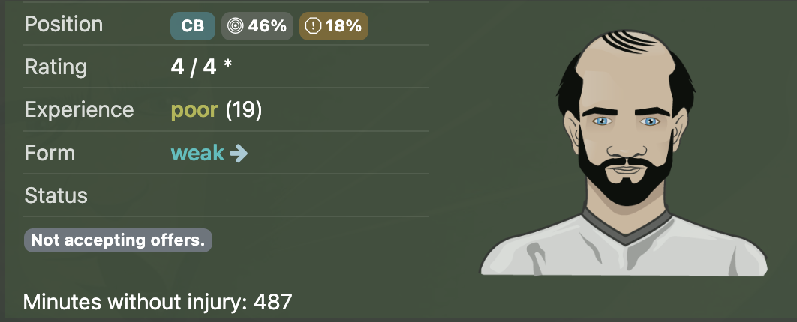

In case your player has been injuried multiple times, the section becomes expandable, just click on it and it will reveal all the injries and minutes. You can see that with enough data we can start to draw some conclusions on when the next injury is likely to come:

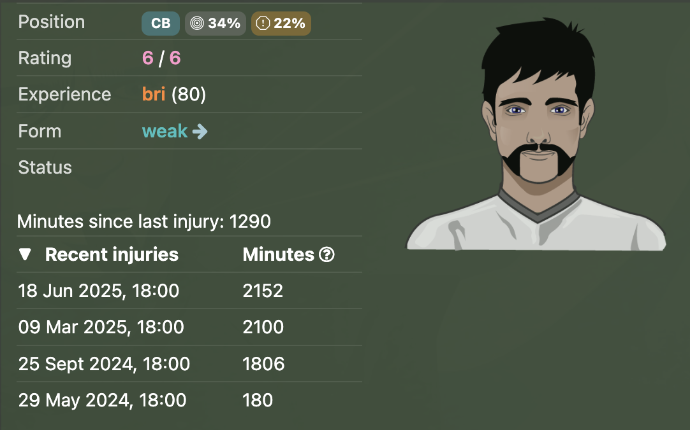

## Players module
The main idea behind the players module is to show the midfield dominance on your squad page. In addition it also shows the long shot ability and midfield dominance when in advanced position (**L/RW**, **OM**, **DM**). If you hover over the numeric values you will see the formulas that are used for calculations.

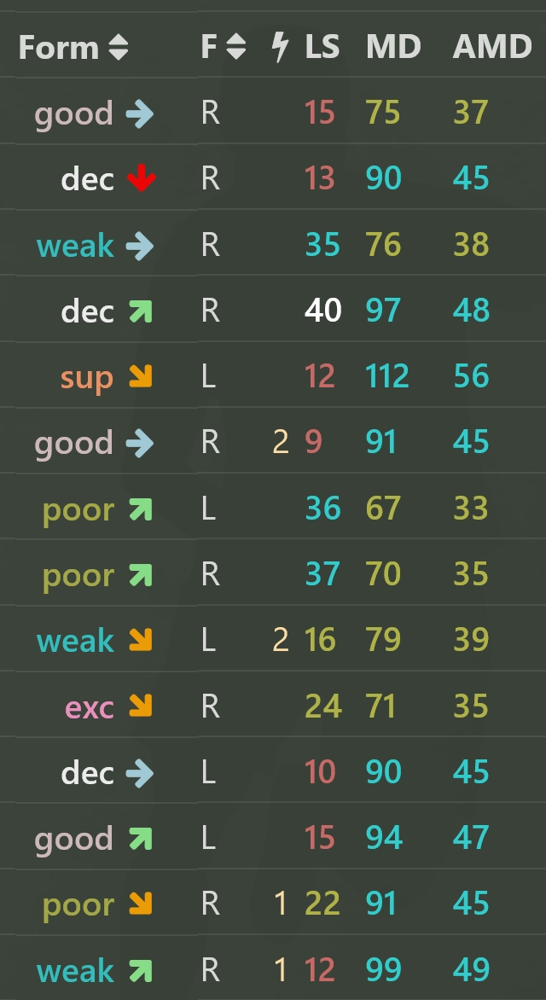

## Row Highlight module
Row highlight allows you to highlight any row on your or your opponent squad page. It can be useful when analyzing lineups for the upcoming games.

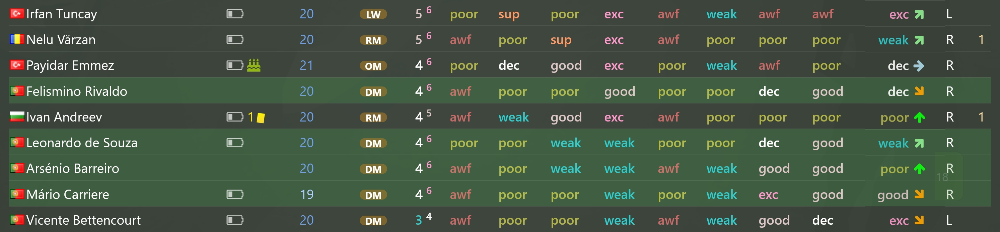

## Tags module
Tags module makes player tags much bigger and allows you to customize tag colors. The original game interface is not ideal, in my opinion, when it comes to tags size and the color selection. With the tags module you get the ability to choose the colors that are more suitable to your needs - do this in the extension options. The tags on the squad sceen and on the training screen are affected.

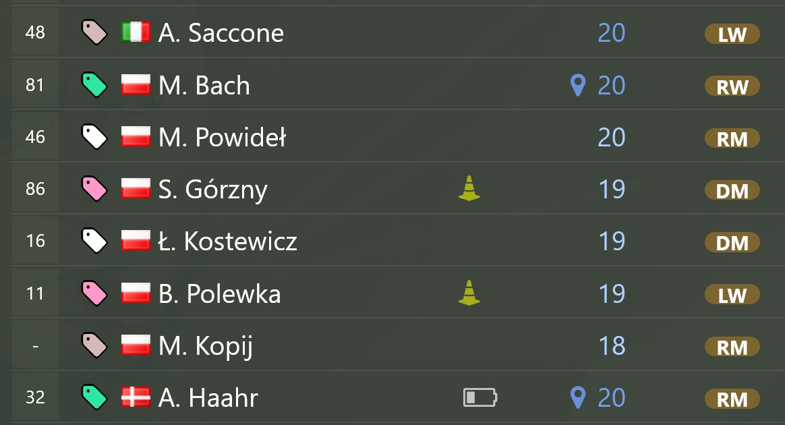
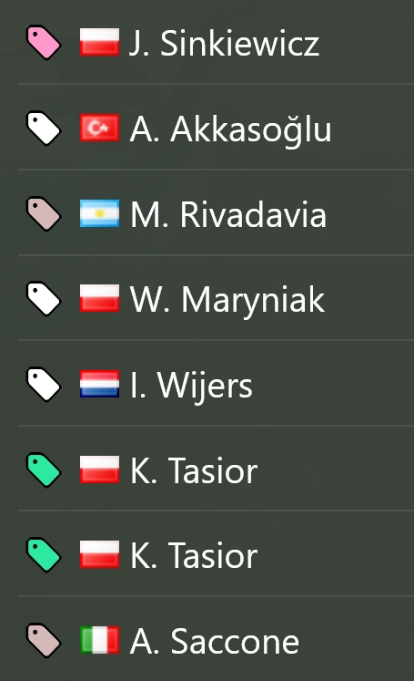

## Version history
### 1.4.0 - current version
 - Moved options to the storage.sync, implemented the player data field on the options screen for convenient local data backup
 - Added injuries and minutes played to the player module
 - Implemented recommended penalty takers functionality
 - Added the match module, it saves the injuries and minutes played for own players only, ignoring friendlies and quick matches for match analyses
 - Fixed the empty folder icon not disappearing when the player data is read in another tab and the table updates
 - Fixed inconsistent tooltips in the player module
### 1.3.1
 - Moved global browser override and storage definition to constants, cleaned up the rest of the files where it was used
 - Fixed lineup module not being saved properly and the console logging inconsistencies
### 1.3.0
 - Added lineup module
### 1.2.0
 - Added computed skills tooltips in the player module
### 1.1.0 - current version
 - Added working options screen
### 1.0.4
 - Added midfield dominance calculations to the computed skills table on the player page
### 1.0.3
 - Fixed the scroll bar appearing at the bottom of the player screen
### 1.0.2
 - Extension becomes multiplatform - works on FF and Chrome-based browsers
 - Updated the midfield dominance calculation for season 25
 - Added the LS formula and calculations to be displayed on hover
### 1.0.1
 - Aligned the players.js script to function properly with the recent changes on the website
### 1.0.0
 - Initial version with 4 modules
