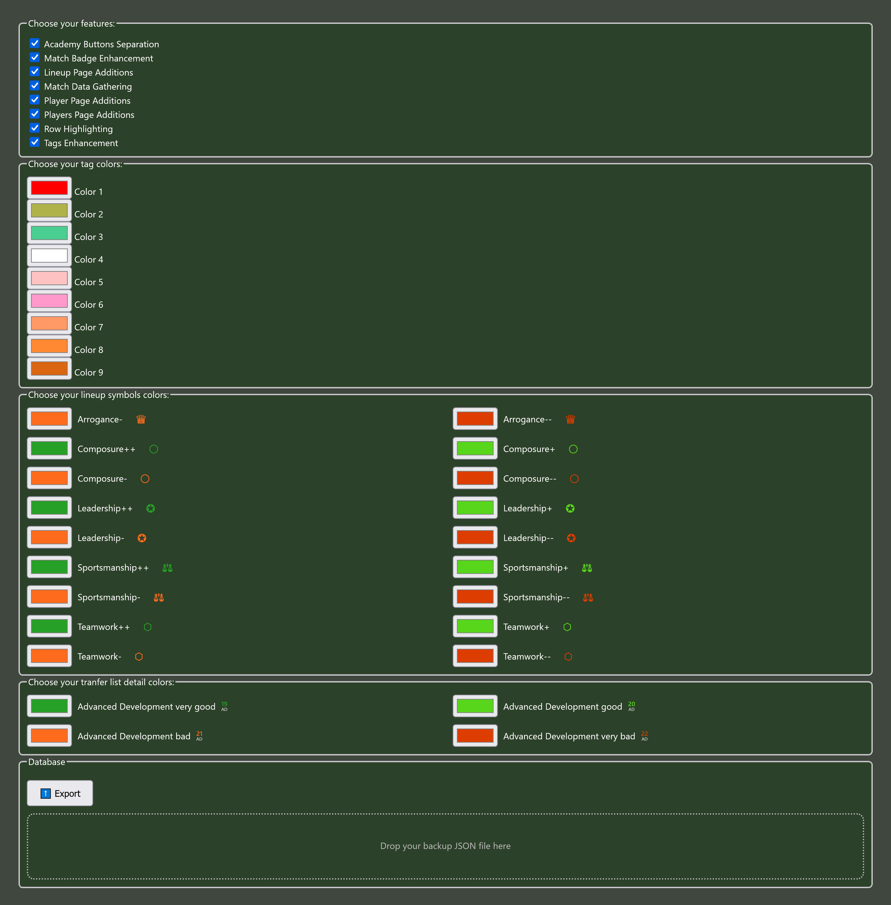

# Final Whistle assistant
I created this browser extension to address some of the problems that, in my opinion, the game interface has. The main idea was to make the midfield dominance easily visible on the squad page as well as on the player page. Midfield dominance being (as of time of writing - September 2025) the main factor in opportunity creation, I think it deserves much more attention than just a mention in the manual. Since then it evolved into this match and player data gathering monster that it is now.

## Supported browsers & download links
1. Chromium based browsers like Chrome or Brave - [the extension is available in the Chrome web store](https://chromewebstore.google.com/detail/final-whistle-assistant/hcnoehlpicjabafnchohpbocakdnmimn).
2. Firefox - [the extension is available on the Firefox extensions page](https://addons.mozilla.org/en-US/firefox/addon/final-whistle-assistant/)

## Overview
The extension is split into functionalities which you can switch on or off on the options screen. Some of the functionalities are just small UI tweaks like button positioning or color customisations. Others are much bigger and require you to visit matches or scout players to work properly. By default, all functionalities are enabled. Read on to learn about each functionality and decide if you want to keep them all on or disable some of them.

## Academy Buttons
The goal of this module is to move the **Hire** and **Fire** buttons apart to prevent accidental misclicks. It was inspired by one of the posts from the [Requested Features List topic](https://www.finalwhistle.org/en/forum/topic/125/page/103)

## Lineup Symbols
This functionality displays additional information in a form of symbols on the lineup->set pieces screen. It is designed to give you a quick overview of which players are suited for special roles, like captain or penalty taker. When in doubt, hover over the symbol and a tooltip will be displayed give you additional information.

There are several symbols available:
 - 📂 - is used to indicate that there is no information available for this player - just visit the player page and the extension will save the info it needs, then reload the lineup screen
 - ✪ - is used to represent the leadership trait
 - ○ - is used to represent the composure trait
 - ♛ - is used to represent the arrogance trait
 - ⚖ - is used to represent the sportsmanship trait

 Each of the symbols is color-coded to give you an idea if it's positive or negative. You can customise the colors in the extension options.

You will notice that sometimes the symbols don't appear even if a player has the specified personality trait. This is to limit the clutter, as you may safely ignore some of the information that is not relevant. For instance, leadership and sportsmanship is always displayed because it's relevant for all players - you want to see which players are suited or not to be a captain, and you want to see which players are likely to foul to decide who to place on CB or DM, but also for other positions sportsmanship -2 is better avoided so this information is always useful. However composure is only important for players that shoot the ball, so it's only shown for forwards and players with relevant penalty kick skill (see below). Similarly, arrogance in context of offside plays is only relevant if the player plays in defence, so only defenders and players with relevant DP skill (see below) will have it. 

Fine tuning options are available so that you can tailor the displayed symbols to your needs:
 1. Arrogance input

In the header above your lineup you will find the arrogance input field which sets the arrogance treshold. Arrogance treshold can be used to fine tune which players will display the arrogance symbol - if the player has negative arrogance personality trait and is positioned in the defence, or is a substitute and his DP is above this treshold, the symbol will appear next to his name. It's defined like this for two reasons: for your senior or youth teams you may want to set a different treshold because the skill difference is usually significant, and for the substitute players we don't know which of them are coming in as defenders, so linking it to DP skill allows for narrowing it down and showing the arrogance symbol only for the relevant subs.

 1. Composure input

 Composure input field can be used to fine tune which players will display the composure symbol - the composure treshold defines the penalty kick value above which the symbol will be shown. For instance, you would assume that your defensive midfielder with awful scoring should not show the composure symbol, however if he has awesome passing he may be considered for taking a penalty in which case the composure symbol next to his name would still be useful. 
 Composure treshold from this field is also used for recommending the penalty takers - essentially the extension will only recommend the players with the penalty kick computed skill value higher than the composure treshold you set.
 
### Recommended Penalty Takers
The extension calculates the penalty kick skill for the players in the lineup and recommends the best takers to you. It also takes into account composure personality as the players with positive composure have better chance of shooting on target. Players with negative composure are not recommended by the extension unless you check the selection box below the composure input to explicitly enable that. Note that the extension has a very strong bias towards positive composure - it is possible that players with significantly lower penalty kick skill will be recommended instead of other players without composure trait, even though the other players penalty kick skill is much higher.

If enough players are found for recommendation, it's split into 2 panels. Left panel displays the composure biased recommendations, and the right panel displays the rest of the players with sufficient penalty kick skill. If you ignore the composure by checking the selection box below the composure input field the players will simply be sorted by the penalty kick skill value.

  
If you feel like one of your players is missing in the recommended set, make sure you visit his page to make sure the extension saves his data, otherwise he is not taken into account during calculations.

### Recommended Anchors
Recommended anchors are chosen based on their aerial skill, with the players with negative sportsmanship filtered out (you don't want your most active defender to cause penalties). 

### Recommended Corner Takers
Corner takers are chosen based on their set pieces cross skill. Note that if your free kick choice is cross, you can safely use the same suggested players there because free kick cross uses the same set pieces cross skill as the corner kick.

## Match Badge
This functionality adds **Y** and **S** letters to the match badges on various screens in the game.
 - fixtures page
 - club page (recent and upcoming matches section)
 - other club fixtures page
 - player page in the Stats tab

More support is coming when I see the badges are missing somewhere, if you noticed a page where they could be added please let me know.

This is again inspired by the [Requested Features List topic](https://www.finalwhistle.org/en/forum/topic/125/page/103) and the goal is to help distinguish which match is youth and which match is seniors, for the ones of us that can't remember which color is what.

## Match Data Gathering
The extension can gather match data, including injuries and minutes played by your players. The idea behind this functionality is to have some data to predict when the next injury may happen. Currently the quick matches and friendlies are ignored since, to my understanding, they don't contribute to injuries. **To add match data to your records visit the match page and switch the lineups from starting to finishing**.

For visualizing which matches are already stored there are visual indicators on various screens in the game when the match report links are visible, these include:
 - fixtures page (own and other clubs)
 - leage page overview and fixtures tab (current and historical leagues)
 - player page stats tab

The indicators can have 4 states:
 1. Red means only the basic data was gathered like match date and starting lineups
 1. Orange means finishing lineups with injuries and minutes played were saved
 1. Yellow means match statistics were also revealed
 1. Green means the full match report was also revealed

With this information you should be able to record all the matches you need or track the history of specific players.

**Note: as of version 3.2.0 saving the statistics and the full match reports is not yet inplemented.**

[Go to Player page section](#player) to see how the data gathered in the match module is utilized there to display the additional information about injuries and minutes played by your players.

## Player
Player page has been enhanced to include additional information, and the highlight of it is the injury tracker. Then there are additional fields in the computed skills table for midfield dominance and offensive/defensive assistance. This is useful not only for your own players but also if you look up a transfer listed player. Speaking of transfer listed players, there is also a mini buying guide below the _Bid_ button that evaluates player personalities and special talents for his designated position.

### Injuries and Minutes Played
Injuries and minutes played functionality displays additional information below the player status:

For this to work correctly you need to make sure to visit as many match reports as you can and always switch the lineup from starting to finishing, only then the information about injuries and minutes played are visible. Rememeber that this is not the exact value used in the game but rather an estimation based on assumptions and approximations. For instance, I assume that in the game where a player gets injuried all the minutes are counted towards the minutes before that injury, even though it is likely that the player continues to play with the injury until the end of the match. Nevertheless I feel this should still give us pretty good idea about how many minutes a player can usually play before getting injuried, and plan our season accordingly.

In case your player has not been injured, you will see how many minutes he played without injury:

In case your player has been injuried multiple times, the section becomes expandable, just click on it and it will reveal all the injuries and minutes. You can see that with enough data we can start to draw some conclusions on when the next injury is likely to come:

### Computed Skills Additions
Additional rows are added for the midfield dominance calculation and offensive/defensive assistance. It shows both current and potential values for those skills and takes personalities into account. In case of midfield dominance you will clearly see how universal midfielders beat OMs and DMs in that department. For the assistance, you will see how positive and negative teamwork personality influences the results (if the player has teamwork personality).

**Note: special talents are not taken into account yet.**

If you are interested how the number in the table were achieved there are tooltips explaining the formulas used for calculations. Hover over the numeric values to see the formulas. They appear on the right of the table and should not obstruct anything else.

### Buying Guide
A mini buying guide appears below the bid button for transfer listed players. It scans through player personalities and special talents and assesses how good or bad the personality is for his designated position, and how useful is his special talent.

## Players
The players page was enhanced by adding more information in form of additional columns in the players table as well as symbols for representing player properties that are normally only visible on the player page.

### Symbols
The symbols of the most useful (in my opinion) personalities are displayed next to the player name.

You can switch them on or off with the checkboxes above the player list. The colors of the symbols can be customised in the extension options.

### Additional Columns
 - long shot computed skill (all players except GK)
 - midfield dominance (all players except GK)
 - offensive assistance (all players except GK)
 - defensive assistance (all players except FW)

**Note: deffensive assistance for GK positions are currently presented as simply their OR - I'm not sure what values are really used in the game**

If you hover over the numeric values you will see the formulas that are used for calculations. These values are color coded in the following way: the maximum for a given skill is calculated, and then the current value, and then both are normalized to x/100 and coloring for the core skills is used. For instance, if a player has 54 OP and 74 BC and teamwork +2, the sum of OP and BC is taken (128) and the benefits from teamwork are added (128 * 25% = 32) which gives us the final result of 160. The maximum offensive assistance would be 200 so the property will be color coded to brilliant becasue 160/200 = 8/10.

## Row Highlighting
Row highlighting allows you to highlight any row on your or your opponent squad page. It can be useful when analyzing lineups for the upcoming games or just managing your players. It comes with 2 flavours:

### Simple Row Highlightint
This is the default highlighting that the game uses on the lineup page, I'm just reusing the styles the game has for highlighting.

### Persistent Highlighting
This highlighting will stay on the screen until you remove it. It was designed for analysing your own and your enemy lineups.

To set the row coloring you can use the context menu - just right click on the row you want to highlight. Or you can use keyboard shortcuts (see below).

You can also clear the page from all persistent highlighting or clear all persistent highlighting from everywhere using this menu. Persistent highlighting works together with simple highlighting, so you can mix them if you wish, just remember that simple highlighting will disappear if you change the players filter.

#### Keyboard Shortcuts
To speed things up you can use keyboard shortcuts to highlight rows quickly. Just mouse over the row you wish to highlight and press:
 - q for LW
 - w for FW
 - shift+w for OM
 - e for RW
 - a for LM
 - s for CM
 - shift+s for DM
 - d for RM
 - z for LB
 - shift+z for LWB
 - x for CB
 - c for RB
 - shift+c for RWB

## Tags
Tags functionality makes player tags much bigger and allows you to customize tag colors. You can customise the tags colors in the extension options. The tags on the squad sceen and on the training screens (all tabs) are affected. Also the tag next to the player name on the player screen.

## Transfers
The transfers screen has been enhanced with additional information from your scouts. All players will show personalities relevant for their position, and players below 21 years of age will also show the estimated potential (EP). Players below 25 years of age will also show their advanced development start year. EP is color coded like the core skills in the game, and AD colors can be customised in the extension options.

## Options
Use extension options to enable/disable the functionality how you see fit, or to customise different colors. Remember to reload the Final Whistle website for the changes to take effect.

### Import/Export Storage
Use this to import/export your settings (modules and colors).

### Modules
The extension is split into modules, each module is responsible for different functionality and you can turn each module on or off here.

### Tag Colors
Customise your tag colors. See [Tags section](#tags) for details.

### Lineup Symbols Colors
Customise your lineup symbols colors. See [Lineup section](#lineup-symbols) for details.

### Transfer List Detail Colors
Customise your transfer list detail colors. See [Transfers section](#transfers) for details.

### Local Data
This setting can be used to backup your local data. Local data is all the data you gathered by visiting you players pages, match reports etc. You build this over time by browsing the game website. The extension works best if you visit all the match reports of your team that you can + the matches of your rivals that you want (switching the lineup from starting to finishing) and all the players that you have on your team + rival players you are interested in. This allows the extension to visualize the injuries, minutes played, suggest penalty takers etc. Once you do all that you don't want this data to be lost - this is why I added the option to export it from the extension. I recommend you do the following: once you visit all the match reports and player pages you want, got to the settings and copy the content of this field into a file, and store it somewhere safe - for example Dropbox or another cloud storage service. This way you are sure that if something goes wrong and you loose the data, you can always restore it from backup. To do that you can paste the contet of your backup directly into the field and press the save button below. This is also useful for moving your data across browsers (Firefox and Chromium) or different machines.
